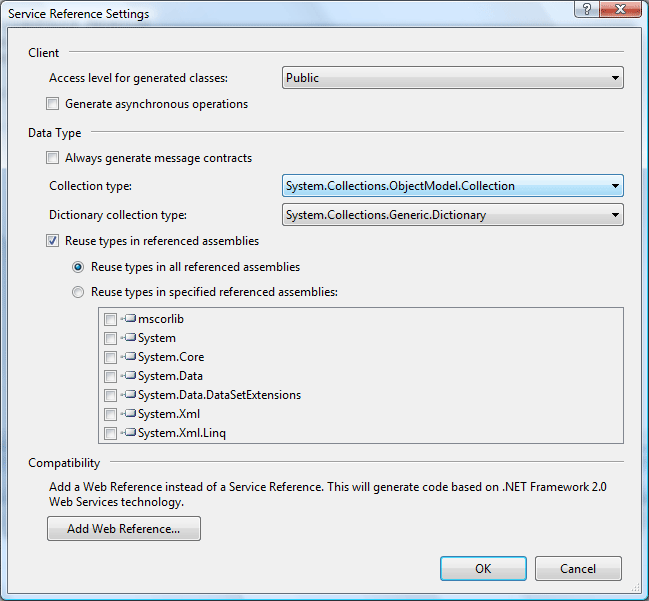

# WCF Data Types

## Introduction

Since I posted this [WCF article](https://github.com/geersch/WCFEssentials) last week some people found my blog by typing in keywords such as "WCF Return As Dictionary" in various search engines.

Controlling the way Collection and Dictionary types used by a Wcf service are represented on the client is actually very easy. In this short article, two methods are demonstrated on how to achieve this.

Let's get started...

## The Demo Service

Let's create a very simple Wcf service that uses a Collection and a Dictionary type. Start up Visual Studio and create a new blank solution named "WcfDataTypes". Next add a new project to the solution called "WcfSampleService" based on the Wcf Service Library project template.

In Listing 1 you can see the service contract is nothing more than a service consisting out of two callable methods. One method that returns a generic collection of key / value pairs (integer keys and string values) and another one that returns a generic collection containing elements of the String type.

Rename the IService1.cs code file to IWcfDataTypeService.cs and delete all of the boilerplate code. Add the code shown in Listing 1.

**Listing 1** - The Service Contract

```csharp
using System;
using System.ServiceModel;
using System.Collections.Generic;
using System.Collections.ObjectModel;

namespace WcfSampleService
{
    // The Namespace property is provided for illustrative purposes
    [ServiceContract(Namespace = "cgeers.wordpress.com")]
    public interface IWcfDataTypeService
    {
        [OperationContract]
        IDictionary<int, string> GetEmployeesAsDictionary();
        [OperationContract]
        ICollection<string> GetEmployeesAsCollection();
    }
}
```

The service contract specifies two callable methods. The first method, GetEmployeesAsDictionary() returns a keyed collection containing the names of employees and their internally unique identifier. The second method, GetEmployeesAsCollection(), retuns a collection of strings containing only the names of the employees.

Listing 2 contains the service type which implements the service contract. For simplicity's sake the list of employees is build on-the-fly in the type's constructor. In a more real world like example you might retrieve this list from a database or some other persistent storage.

Rename the Service1.cs file to WcfDataTypeService.cs and again delete all of the boilerplate code. Add the code shown in Listing 2.

**Listing 2** - The Service Type

```csharp
using System;
using System.Collections.Generic;
using System.Collections.ObjectModel;
using System.ServiceModel;

namespace WcfSampleService
{
    [ServiceBehavior(InstanceContextMode = InstanceContextMode.Single,
        ConcurrencyMode = ConcurrencyMode.Single)]
    public class WcfDataTypeService : IWcfDataTypeService
    {
        #region Instance Fields

        private Dictionary<int, string> employees =
            new Dictionary<int, string>();

        #endregion

        #region Constructor(s)

        public WcfDataTypeService()
        {
            employees.Add(1, "Bruce");
            employees.Add(2, "Matthew");
            employees.Add(3, "Andrew");
            employees.Add(4, "John");
            employees.Add(5, "Edward");
        }

        #endregion

        #region IWcfDataTypeService Members

        public IDictionary<int, string> GetEmployeesAsDictionary()
        {
            return employees;
        }

        public ICollection<string> GetEmployeesAsCollection()
        {
            ICollection<string> result = employees.Values;
            return result;
        }

        #endregion
    }
}
```

Don't forget to replace the references to IService1 and Service1 in the App.config file with IWcfDataTypeService and WcfDataTypeService respectively. For this sample I have also set the binding to TCP in order to speed things up. Take a look at the accompagnying source code of this article to see how the App.config file is setup.

## Generating Proxy Code Using svcutil.exe

If you're using Visual Studio 2005 or you just don't like the new Add Service Reference dialog of Visual Studio 2008 then working with the [svcutil.exe command-line tool](http://msdn2.microsoft.com/en-us/library/aa347733.aspx) is the best way to generate a client-side proxy.

Using this tool you can generate a new client-side proxy and configuration file. You only need to specifiy the service's endpoint, the name of the code file where the generated proxy should reside and the name of the resulting configuration file.

Listing 3 demonstrates the most basic usage.

**Listing 3** - Generating a Client-side Proxy Using svcutil.exe

```sh
svcutil net.tcp://localhost:8731/WcfDataTypeService /out:datatypesProxy.cs /config:app.config
```

Next add a new Console Application named ProxyClientApplication1 to the solution. Make sure that you set a reference to the System.ServiceModel.dll assembly and include the two files you just generated.

You can now create a proxy by instantiating an instance of the generated proxy type WcfDataTypeServiceClient. If you were to call the two methods you'll see that the GetEmployeesAsDictionary() method in fact returns a dictionary, but the GetEmployeesAsCollection() method does not return a collection but an array of string items. Listing 4 shows an excerpt from this client application.

**Listing 4** - ProxyClientApplication

```csharp
using (WcfDataTypeServiceClient proxy = new WcfDataTypeServiceClient())
{
    Console.WriteLine("***** Dictionary<int, string> *****");
    IDictionary<int, string> employees = proxy.GetEmployeesAsDictionary();
    foreach (string employee in employees.Values)
    {
        Console.WriteLine(employee);
    }
    Console.WriteLine();

    Console.WriteLine("***** String array? *****");
    string[] stringArray = proxy.GetEmployeesAsCollection();
    foreach (string employee in stringArray)
    {
        Console.WriteLine(employee);
    }
    Console.WriteLine();
}
```

The Svcutil.exe tool provides the option /collectionType:<type> (shorthand notation: /ct) to specify the type to be used as the collection data type. If you want that the GetEmployeesAsCollection() method should return a generic collection containing elements of the String type, then generate the proxy as shown in Listing 5.

**Listing 5** - Generating a Client-side Proxy Using The /collectionType Option

```sh
svcutil net.tcp://localhost:8731/WcfDataTypeService /out:datatypesProxy.cs /config:app.config
/ct:System.Collections.ObjectModel.Collection\`1
```

Voila, that should result in a client-side proxy that interpretes the result of the GetEmployeesAsCollection() method as a generic collection containing elements of the String type. The accompagnying source code of this article contains a project called ProxyClientApplication2 which contains a client-side proxy generated in this manner. Check it out if needed.

As you have seen the default action taken by the svcutil.exe tool is to generate a regular array of string items as the result of the GetEmployeesAsCollection() method on the client-side proxy. Why? Well, this representation will work if the client is made using .NET or an alternative platform.

On the other hand the result of the GetEmployeesAsDictionary() method is always represented on the client side as a dictionary no matter what value you pass to the /collectionType option. Why? Well, there is no way to convert a .NET dictionary type to something universal that is understood by alternative platforms. When serialized over the wire the dictionary type is represented as a complex type consisting out of name-value pairs. The .NET client knows that it should convert this complex type back into a dictionary.

Take a look at [Matevz Gacnik's Weblog](http://www.request-response.com/blog/PermaLink,guid,ff5fab81-affb-4b2b-aa67-c80bdfc86cbd.aspx) which has an excellent article that digs deeper into this subject.

## Generating Proxy Code Using Visual Studio 2008

The new Add Service Reference dialog introduced in Visual Studio 2008 lets you generate a client-side proxy very easily without the need to resort to dealing with the svcutil.exe command-line tool in most cases.

If you wanted to control the way a collection was represented on the client-side you would need to resort to the svcutil.exe tool in earlier versions of Visual Studio. Many of the advanced features of this tool were abscent in the old Service Reference dialog.

You can access the new dialog by right-clicking inside the project in the Solution Explorer and selecting Add Service Reference fromt the context menu. If you click on the button labelled Advanded when adding a service reference you'll be presented with a bunch of options which let you control how the proxy will be generated. Take a look at the following screenshot.



Not all of the options of the svcutil.exe tool are included here, but for most projects the advanded options available in this dialog should suffice. The Visual Studio team spends a great deal of time figuring out which is the best default value for each option, so for most options you won't have to change the value.

You can control the way Collection types and Dictionary collection types are represented in the client-side proxy by simply selecting the appropriate type.

The following two comboboxes are provided for this purpose:

- **Collection type**: Specifies the list collection type (Default: Array).
- **Dictionary collection type**: Specifies the dictionary collection type (Default: Dictionary<TKey, TValue>).[](<http://msdn2.microsoft.com/nl-be/library/xfhwa508(en-us).aspx>)

You can always update the client-side proxy by selecting the service reference and clicking on Configure Service Reference afterwards.

Check out the ProxyClientApplication3 project in the accompagnying source code of this article which contains a proxy generated using the new Add Service Reference dialog of Visual Studio 2008.

## Conclusion

The new Add Service Reference dialog sure makes life a lot easier compared to generating client-side proxies using the svcutil.exe command-line tool. Controlling the way collection types are represented on the client side is a piece of cake using this new and improved dialog.
